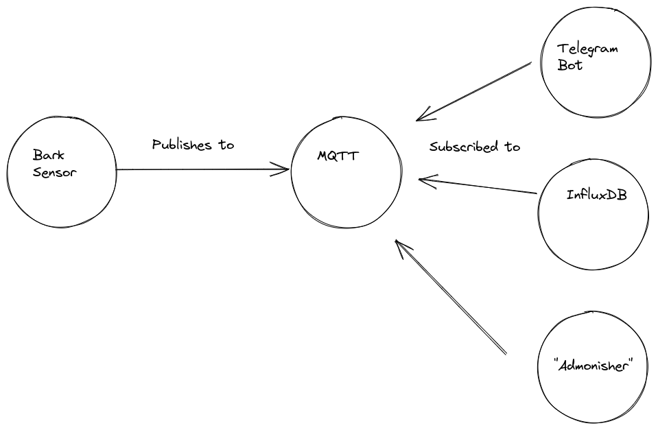
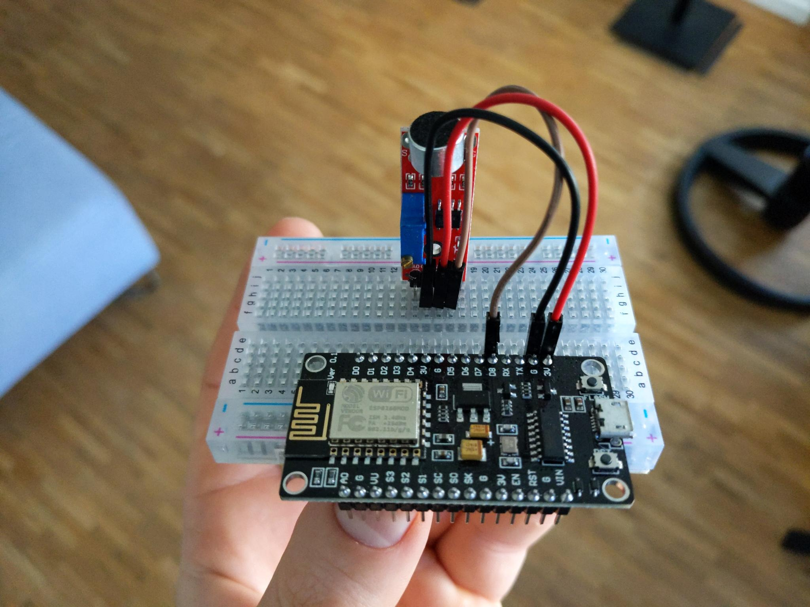
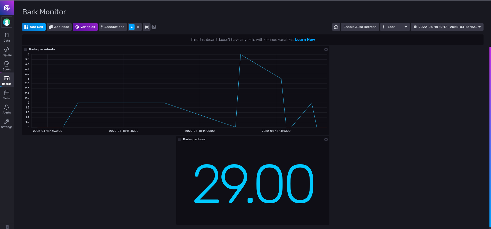
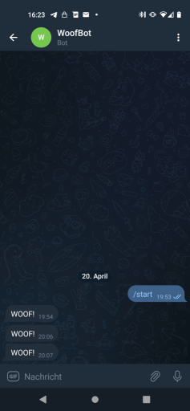

# Barkbox

A small ioT project to log and cope with the barking of my dog when she is alone.
It consists of:

* A bark sensor
* DockerCompose files to run the server that consists of
  * MQTT to publish barking to and to serve the following subscribers
  * An InfluxDB for bark analysis
  * A Telegram bot to send barking notifications

A script I called "admonisher" that plays audio to talk to my dog when she barks and I am not at
home.

The basic setup looks like this:

## Hardware Used

For the bark sensor:

* ESP8266 Microcontroller
* KY-037 Sound Detection Sensor Module

A small server that runs the `docker-compose` file. I could Imagine a Raspberry PI also doing the job.

My Laptop to run the "admonisher" on. I needed the mobility to access my speakers. There is no other
reason for seperating this part from the rest.

## The Sensor

The sensor is pretty easy to set up. It only consists of the two parts mentioned above I put on a
breadboard. I am using a digital IO Pin as an Input for the noise detector. The sensitivity can be
controlled via a screw on the sensor. Check the datasheet for more details. Once the noicelevel
exceeds the configured threshold the detection modules sends a signal.

This is how it looks in the end:

The code to program this module can be found in `./arduino`. I used the `ArduinoIDE` the board must
be added via the `BoardManager` like described [here](https://github.com/esp8266/Arduino).

A thing that cost me quite some time: I could not upload the code to the controller while the noise
detector was wired to it. Disconnecting it temporarily from the power helped with that.

The code itselfis rather simple. All it really does is trying to push detected barks to a MQTT topic
and that's it. The APIs are very highlevel and easy to understand. To make this run in any
environment only the configuration within the file needs to be adjusted.

At the moment it is pushing a value "1" to a topic `livingroom/barking`.

## The InfluxDB and Telegraf

InfluxDB is used to analyse the barking over time as I wanted to know how much barking was actually
going on. Within the `docker-compose` file `Telegraf` is configured to transport events from MQTT to
influxDB. I added a very basic dasboard:

Telegraf is configured via a configuration file that is inside the docker directory: `./docker/telegraf.conf`

There is an `environment` file that expects the InfluxDB API token. This is required for `Telegraf`
to work.

## Telegram Bot

In order to make this work you need to [create a Telegram Bot](https://core.telegram.org/bots)

After you created it, start a chat with it and visit this endpoint to receive the chatId:

https://api.telegram.org/bot$yourToken/getUpdates ($yourToken needs to be replaced)

The token as well as the chat id need to be provided in this file `./subscriber/tg_bot/keys.json`.
An example is provided within this repository, the example extension needs to be removed.
The Telegram Bot can also be build as a docker container and is contained within the `docker-compose` file.

When setup correctly you should receive messages like this every time your dog barks:

## Admonisher

I could not come up with a better name by now. This subscriber to the MQTT waits for barks. Once one
is received it plays a random audio file. *Audio files are not included within this project and
needed to be added*. Put your personal greetings to your dog into `./subscriber/admonisher/audio`.
I used mp3. Other formats might work, but I have not tried.

The admonisher is not part of the `docker-compose` file, as I was running it on a separate machine.
But it should be easy to add if required.
